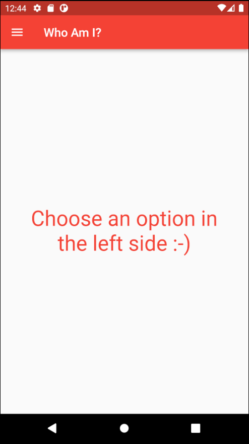
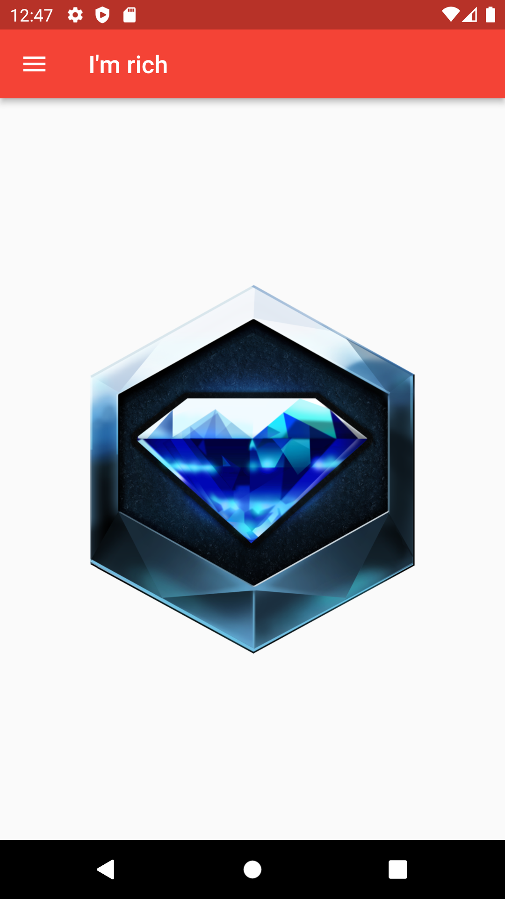
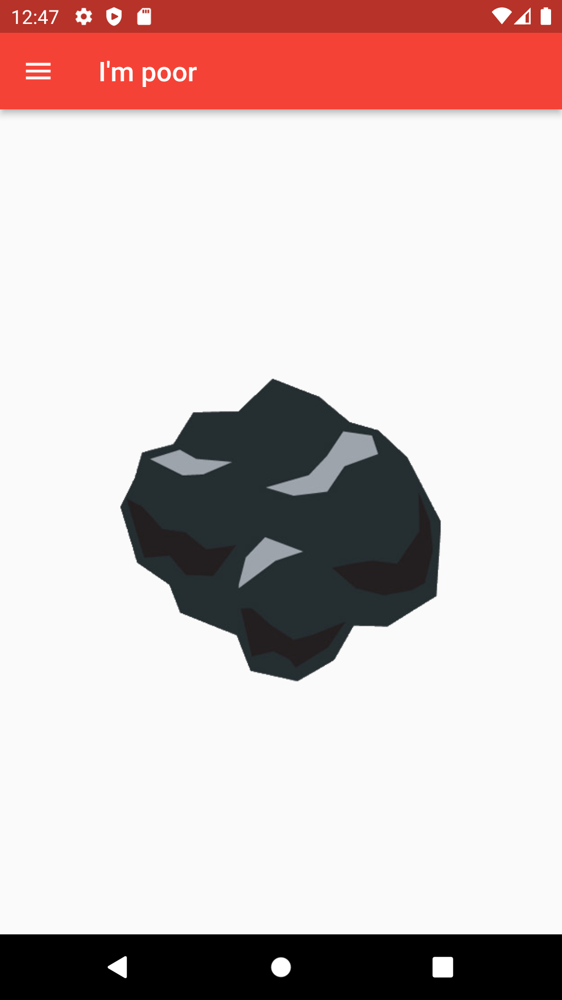
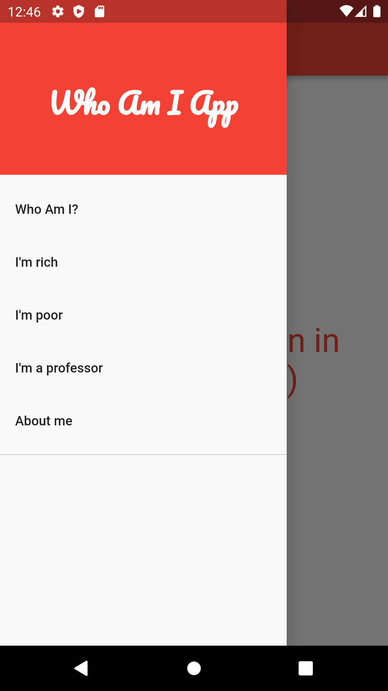
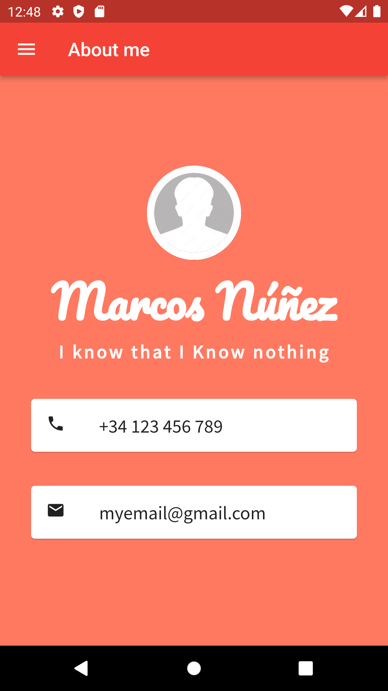

# WhoAmIApp

App destinada a cacharreo variado y resolución de varios ejercicios en una sola app para el curso de Flutter de Víctor Carreras. 
Se han implementado las siguientes funcionalidades:
- Panel de navegación lateral (Navigation Drawer).
- Pantalla de "soy rico".
- Pantalla de "soy pobre".
- Pantalla de "soy profesor"
- Pantalla de carta de presentación.

## Pantallas básicas
</img>
</img>
</img>
</img>

## Barra de navegación
</img>

## Carta de presentación
</img>
